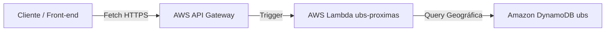

# 🛰️ RadarSaúde — Localizador Serverless de Unidades Básicas de Saúde (UBS)

O **RadarSaúde** é uma aplicação web intuitiva e de alta performance projetada para facilitar o acesso de cidadãos às Unidades Básicas de Saúde (UBS) mais próximas. A solução utiliza recursos nativos de geolocalização do navegador ou busca por CEP para consultar uma base de dados oficial do CNES (Cadastro Nacional de Estabelecimentos de Saúde), processando as requisições por meio de uma arquitetura 100% **Serverless** na **Amazon Web Services (AWS)**.

---

## 🏗️ Arquitetura do Sistema

O projeto foi desenhado sob a filosofia Serverless, garantindo escalabilidade automática, alta disponibilidade e custo operacional praticamente zero (integrando-se inteiramente ao *AWS Free Tier* sob demanda).



### Detalhes dos Componentes:

1. **Front-End (Camada de Apresentação):**
   * Desenvolvido em **HTML5**, **CSS3 (Sass)** e **JavaScript Vanilla (ES6+)**.
   * Consome a API de Geolocalização do navegador (`navigator.geolocation`) com tratamento robusto de permissões e estados.
   * Realiza chamadas assíncronas assentes em `fetch` direcionadas ao endpoint seguro da API Gateway.

2. **AWS API Gateway (Camada de Exposição):**
   * Ponto de entrada unificado para as requisições HTTP (`GET`).
   * Configuração de CORS ativa para permitir requisições seguras originadas do domínio do front-end.
   * Encaminha parâmetros de rota e query strings (`lat`, `lon`, `limite`) diretamente para a função Lambda de forma otimizada.

3. **AWS Lambda — `ubs-proximas` (Camada de Processamento):**
   * Função executada sob demanda encarregada de receber as coordenadas de latitude/longitude ou CEP.
   * Realiza a lógica de aproximação espacial para retornar de forma ordenada as UBSs mais próximas geograficamente, limitando a quantidade de registros retornados para otimizar o payload.

4. **Amazon DynamoDB — Tabela `ubs` (Camada de Dados):**
   * Banco de dados NoSQL totalmente gerenciado pela AWS.
   * Armazena mais de 40.000 registros do Cadastro Nacional de Estabelecimentos de Saúde (CNES).
   * Schema flexível otimizado contendo atributos vitais como `CNES`, `IBGE`, `BAIRRO`, `LATITUDE`, `LONGITUDE`, `LOGRADOURO` e nome do estabelecimento.

---

## ⚡ Tecnologias Utilizadas

* **Front-end:** HTML5, CSS3, JavaScript (ES6+), VS Code
* **Provedor Cloud:** Amazon Web Services (AWS)
* **Serverless Compute:** AWS Lambda (Node.js/Python)
* **Gateway de API:** AWS API Gateway
* **Banco de Dados:** Amazon DynamoDB (NoSQL)

---

## 🚀 Como Executar o Projeto Localmente

### Pré-requisitos
Para rodar a interface web em sua máquina local, você precisará apenas de um navegador moderno e um servidor local simples (como a extensão *Live Server* do VS Code ou o módulo `http.server` do Python).

### Passos para Execução:

1. **Clonar o repositório:**
   ```bash
   git clone https://github.com/seu-usuario/radar-saude.git
   cd radar-saude
   ```

2. **Configurar o Endpoint da API:**
   Abra o arquivo `script.js` e altere a constante `API_BASE_URL` para apontar para o seu endpoint ativo do API Gateway:
   ```javascript
   const API_BASE_URL = 'https://seu-api-id.execute-api.us-east-1.amazonaws.com/default';
   ```

3. **Iniciar a aplicação:**
   * Se estiver usando o VS Code, clique com o botão direito no `index.html` e selecione **Open with Live Server**.
   * Ou utilize o terminal:
     ```bash
     # Python 3
     python -m http.server 8000
     ```
   * Abra seu navegador e acesse: `http://localhost:8000`

---

## 📋 Estrutura de Arquivos do Front-End

```text
├── index.html       # Estrutura semântica da página de busca
├── style.css        # Estilização moderna e responsiva
├── script.js        # Lógica de consumo da API e manipulação do DOM
└── README.md        # Documentação do projeto
```

---

## 🛠️ Configuração da Infraestrutura AWS (Referência)

### 1. DynamoDB
* Criar uma tabela chamada `ubs`.
* Configurar chave de partição (`Partition Key`) adequada para consultas (ex: `CNES` como String ou ID único).
* Importar a base de dados do CNES do Ministério da Saúde para a tabela.

### 2. AWS Lambda
* Criar uma função chamada `ubs-proximas`.
* Configurar variáveis de ambiente necessárias.
* Garantir que a Role de Execução do Lambda possua permissões de leitura no DynamoDB (`dynamodb:Scan` ou `dynamodb:Query`).

### 3. API Gateway
* Criar uma API REST ou API HTTP.
* Definir uma rota `GET /ubs-proximas`.
* Integrar com a função Lambda `ubs-proximas` usando o tipo de integração proxy do Lambda.
* **Importante:** Habilitar o CORS nas configurações da rota do API Gateway para evitar bloqueios de segurança no front-end.

---

## 🧑‍💻 Autor

Desenvolvido por **Antonio Agostinho Gomes Bezerra (Antonio Bezerra)**.  
Conecte-se comigo no [LinkedIn](https://www.linkedin.com/)!  
